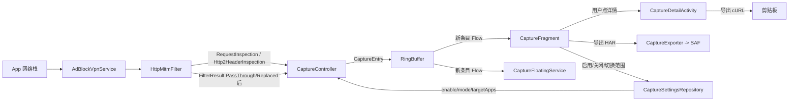
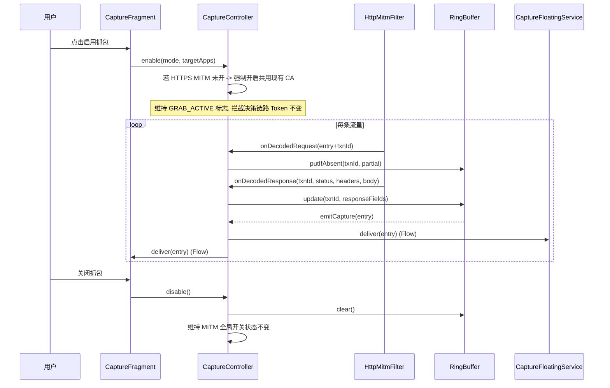

# Traffic Capture

Feature Name: traffic-capture
Updated: 2026-08-01

## Description

为 HanFeng 广告拦截 App 增设第四个主界面"抓包"Tab 与配套悬浮窗, 全面对齐 HTTPCanary 的抓包能力: 实时查看(列表+详情)、TLS 信息查看、修改请求/响应(断点机制)、请求重放、抓包模板、筛选搜索、多语言命令导出(cURL/Postman/Java/Python/JS)、HAR 1.2 导出、抓包统计、悬浮窗实时列表。功能依托现有 VPN + HTTPS MITM 管线(`AdBlockVpnService` + `HttpMitmFilter` + `TlsMitmSessionManager` + `TlsMitmContextFactory` + `CertificateAuthorityManager`), 与广告拦截共用同一套本地 CA。抓包开启时强制激活 HTTPS MITM 路径; 抓包以只读旁路方式挂接在拦截决策链上, 仅当用户主动开启断点时才挂起对应 IO 线程等待用户编辑, 不因抓包的旁路读取改变拦截结果。抓包对象可按 App 或全量; 开启时由前台 Service 通过 WindowManager 渲染可拖动的实时列表悬浮窗; 抓包记录常驻内存环形缓冲, 关闭即清空(请求模板除外, 可跨会话)。

## Architecture





### Capture 旁路接入点

旁路只读取**已解码完成**的请求/响应字段, 不参与任何决策返回; 当存在断点时改为阻塞等待用户编辑后再替换返回:

| 接入方法 (HttpMitmFilter) | 现有调用点 | 旁路新增调用 |
|---|---|---|
| `inspectRequest(session, chunk)` 返回 `RequestInspection` 后 | `HttpsHandshakeEngine` 主线程同步 | `CaptureController.onDecodedRequest(txnId, RequestInspection)`; 若 `BreakpointRepo.match(host,method)` 命中, 调用阻塞返回 `ByteArray?`: null=放行原值, 非null=用其替换 chunk |
| `inspectBufferedHttp1Response(...)` 返回 `BufferedHttp1Result.Ready` 后 | VPN 数据面后台 | `CaptureController.onDecodedResponse(txnId, status, headers, bodyPreview)`: 同上断点机制应用响应替换 |
| `inspectHttp2Headers(...)` 返回 `Http2HeaderInspection` 后 | HTTP/2 帧解析后台 | `CaptureController.onDecodedHttp2Headers(txnId, Http2HeaderInspection)`: 断点机制 |
| `inspectHttp2DataSample(...)` 返回 `Http2DataInspection` 后 | HTTP/2 数据后台 | `CaptureController.onDecodedHttp2Body(txnId, sample)`: 仅只读采样写入, 无断点(数据帧已是已分片) |

各接入点统一经过 `CaptureController.onXxx` 内部 `try/catch` 吞错 + `Dispatchers.IO` 切换, 不在主线程做任何阻塞复制。断点等待通过 `CompletableDeferred<ByteArray?>` + 30s 硬超时实现; 超时不阻塞 VPN 数据面线程。

### 断点流 (Breakpoint) 与改写流 (Rewrite)

```mermaid
sequenceDiagram
    participant HM as HttpMitmFilter
    participant CC as CaptureController
    participant BR as BreakpointRepo
    participant F as CaptureFragment
    participant D as CaptureDetailActivity
    participant U as 用户

    HM->>CC: onDecodedRequest(txn, req)
    CC->>BR: match(host, method)?
    alt 不命中
        CC-->>HM: 透传原值, 继续走拦截决策链
    else 命中
        CC->>BR: pending(txn, capturedReq)
        CC->>F: emitBreakpointHit(txn)
        F->>U: 通知断点命中(悬浮窗也亮)
        U->>D: 编辑请求草稿
        U->>D: 放行/替换后放行/丢弃
        D->>CC: resumeFromBreakpoint(txn, action, draft?)
        CC->>BR: resolve(txn, action, draft?)
        CC-->>HM: 替换 chunk / 丢弃 / 放行原chunk
        HM 继续走拦截决策链
    end
    Note over HM,CC: 同理对响应断点, 在 bufferedHttp1Response Ready 后挂起
```

断点匹配规则: `BreakpointMatchRule(host + method + path前缀)`, 用户在 CaptureDetailActivity 改请求/响应草稿页面同时勾选"对此路径加断点"以把规则加入 `BreakpointRepo`。

改请求生效范围与持久化: 全部规则**仅内存**, disable 抓包即清, requirements 6 / 8 / 9 已明确。

### 重放流 (Replay)

```mermaid
sequenceDiagram
    participant U as 用户
    participant D as CaptureDetailActivity
    participant R as ReplayEngine
    participant T as VPN上游客户端
    participant RB as RingBuffer

    U->>D: 打开重放编辑(预填原 entry)
    U->>D: 修改后点"发送"
    D->>R: replay(method, host, path, headers, body)
    R->>T: 在 VPN 用户空间内打开新 Socket
    T->>R: 完成 TLS 握手(用系统默认信任, 不是本地 CA)
    T->>T: 发 HTTP 请求并读响应
    R->>RB: 新一条 entry, replayed=true, packageName=本App
    R-->>D: status + 响应
    D 展示结果供用户查看
```

重放不走 MITM 解码自己的请求(因为请求是 App 内部发起, 走 OkHttp 信任本地 CA 即可), 但仍写入抓包缓冲供与原请求对照。

## Components and Interfaces

### 新增组件

#### 1. `CaptureController` (object)

抓包控制中枢, 唯一可信状态机。无锁 `AtomicReference<Snapshot>` 持有当前模式, 仅 `enable/disable` 主入口持有写者; 旁路读模式极快。

```kotlin
object CaptureController {
    enum class Mode { BY_APP, ALL_APPS }
    data class Snapshot(
        val active: Boolean,
        val mode: Mode,
        val targetApps: Set<String>, // BY_APP 模式下非空; ALL_APPS 模式下忽略
        val maxEntries: Int,         // 默认 200; 通过设置可调
        val bodyPreviewBytesAll: Int,    // ALL_APPS 默认 8 * 1024
        val bodyPreviewBytesByApp: Int,  // BY_APP  默认 32 * 1024
    )

    val current: StateFlow<Snapshot>      // 外部只读
    val entries: SharedFlow<CaptureEntry> // 外部只读, replay=0, extraBufferCapacity=512

    fun enable(mode: Mode, targetApps: Set<String>): Result<Unit>
    fun disable()
    internal fun onDecodedRequest(txnId: Long, inspection: RequestInspection, appName: String?)
    internal fun onDecodedHttp2Headers(txnId: Long, inspection: Http2HeaderInspection, appName: String?)
    internal fun onDecodedResponse(txnId: Long, status: Int, headers: Map<String,String>, bodyPreview: ByteArray?)
    internal fun onDecodedHttp2Body(txnId: Long, sample: ByteArray?)
    fun snapshot(): List<CaptureEntry>
}
```

启用互斥: SharedPreferences 持久化 flag, 第二次 `enable` 时若 snapshot 已 active 直接返回 `Success`; `disable` 时 await 清空 ring buffer 后再切到 inactive。

#### 2. `CaptureRingBuffer`

固定容量无锁环形队列, 同时支持按 `/txnId/ -> entry index` 的 hashmap 索引更新响应字段。容量通过 `CaptureController.enable(maxEntries)` 配置。

并发模型: `ConcurrentLinkedDeque` + `ConcurrentHashMap<Long, CaptureEntry>`; 丢弃策略 `takeLastWhile { it.txnId != droppedTxnId }`。GC 友好: body 字段一旦确定预览大小就脱钩 ring buffer, 不复用底层 ByteBuffer。

#### 3. `CaptureFloatingService` (foreground Service)

复用 `FloatingBallService` 范式, 但渲染内容是 RecyclerView + WindowInsetsAnimation 兼容长按。半透明圆角矩形(宽 280-360dp, 高 wrap, 顶贴顶偏下 80dp)。每条 entry 单行: `[GET] api.example.com /v1/feed · 200 · 142ms · 抖音`。点击跳转 `MainActivity` extra `tab=capture&focus=txnId`。长按弹关闭按钮。Service onCreate 同步 `addView` 后再走业务逻辑(沿袭 `WirelessDebugFloatingService` 学习到的 HyperOS 兼容)。

#### 4. `CaptureFragment`

替换/扩展 `MainPagerAdapter` 第 4 个 Tab。顶部 ControlBar(启用开关 + 模式切换 + 目标 App 选择按钮 + 清空), 其下 RecyclerView 列表。订阅 `CaptureController.entries`。空态展示启用说明 + 安全提示。

#### 5. `CaptureDetailActivity`

详情页,卡片视图(请求 / 响应),Tabs(Headers / Body / Preview / cURL / Raw)。文本 body 用 `JsonFormatter`/`HtmlBeautifier`/`XmlBeautifier` 二选一美化 → 失败兜底 `hex dump`。

#### 6. `CaptureRepository`

持久化抓包相关 SharedPreferences(`targetApps`、`mode`、`maxEntries`、`redactMode`),与现有 `HttpsMitmRepository`/`FeatureSettingsRepository` 同包同风格。

#### 7. `CaptureExporter`

把 `List<CaptureEntry>` 横跨为 HAR 1.2 JSON。`redactMode = true`(默认)时把 `Authorization`/`Cookie`/`Set-Cookie`/`X-Token` 值替换为 `***`,在文件头 `_comment` 字段标注。cURL/Postman/Java/Python/JavaScript 多语言命令导出走 `CaptureExporter.formatAs(entry, LanguageEnum)`, 共用同一份 header 脱敏 pipeline。cURL 含 `--resolve host:443:127.0.0.1` 与 `-k` 兜底自签证书。

#### 8. `BreakpointRepo` (object)

内存高速匹配 + 等待回调: `ConcurrentHashMap<MatchRule, BreakpointChannel>` + `ConcurrentHashMap<Long, CompletableDeferred<ByteArray?>>` 按 txnId 等待。提供 `registerRule(MatchRule)` / `unregisterRule` / `match(host, method, path): BreakpointChannel?` / `awaitResume(txnId): ByteArray?` 五个核心 API。所有 API O(1)。

`MatchRule = data class (host, method?, pathPrefix?, kind: REQUEST|RESPONSE)`, 由 CaptureDetailActivity 改写页面点"加断点"写入。

#### 9. `CaptureReplayEngine`

独立的 socket 客户端, 不复用 VPN 数据流路径。流程: 根据目标 scheme/host/port 打开 Socket → 若 https 则用系统 `SSLSocketFactory` 完成握手(默认系统 CA, 不绕本地 CA, 因为重放是 App 内自己发起, 同走本机证书校验链) → 写 HTTP/1.1 请求 → 读响应 → 转为 `CaptureEntry(txnId=replay-$seq, replayed=true)` 写入环形缓冲并把详情页回馈给用户。

#### 10. `CaptureTemplateRepository` (object, 持久化)

通过 SharedPreferences JSON 序列化保存用户从历史 entry 创建的请求模板, key 仅包含 method/host/path/headers/body 不耦合捕包上下文。抓包 Tab 顶"从模板重放"入口打开模板列表 Activity → 选中后 prefill 进 CaptureReplayEngine 编辑页。

### 现有组件改动

| 组件 | 改动 | 行数估算 |
|---|---|---|
| `MainPagerAdapter` | `getItemCount()` 3→4, 新增 `position=3 -> CaptureFragment()` | 6 |
| `MainActivity` ViewPager tab 顺序布局 | 增 1 个 tab 标题 | 8 |
| `AdBlockVpnService.onStartCommand` 或 `onVpnStarted` | 抓包启用时调 `CaptureController.syncFromPrefs()` | 4 |
| `HttpMitmFilter` 4 个入口方法返回后插入 `CaptureController.onXxx` 调用 | 套 try-catch 包装函数 `tapCapture(...)` | 8 |
| `HttpMitmFilter.filterResponse` 同理 | 同上 | 4 |
| `HttpsMitmController` | 抓包启用时同时强制 `FeatureSettingsRepository.setHttpDecryptEnabled(true)` 共享 CA; 关闭抓包不回退(留由用户自己关闭 MITM) | 2 |

## Data Models

```kotlin
data class CaptureEntry(
    val txnId: Long,                  // 全局递增,来自 System.nanoTime 高位
    val timestampMs: Long,            // System.currentTimeMillis
    val appName: String?,             // BY_APP 模式下必有, ALL_APPS 可空
    val packageName: String?,
    val scheme: String,               // "http" / "https"
    val method: String,               // GET/POST/...
    val host: String,
    val path: String,
    val httpVersion: String,          // HTTP/1.1 / HTTP/2
    val requestHeaders: Map<String, String>,
    val requestBodyPreview: ByteArray?,
    val requestBodyTruncated: Boolean,
    val responseStatus: Int,          // 0=未到达
    val responseHeaders: Map<String, String>,
    val responseBodyPreview: ByteArray?,
    val responseBodyTruncated: Boolean,
    val durationMs: Long,             // 响应到达后填, 0=未完成
    val error: String? = null,        // 抓包过程中若上游 timeout/cancel 记录原因
    val intercepted: Boolean = false, // 是否被广告拦截链路拦截(对照观察用)
    val tlsMeta: TlsMeta? = null,
    val replayed: Boolean = false
) {
    val isComplete: Boolean get() = responseStatus != 0
    val isPendingBreakpoint: Boolean get() = error == "breakpoint-pending"
}

data class TlsMeta(
    val sni: String?,
    val protocol: String,             // TLSv1.2 / TLSv1.3
    val cipherSuite: String,
    val alpn: String?,                // "h2" / "http/1.1"
    val peerCertificates: List<CertMeta>
)

data class CertMeta(
    val subject: String,
    val issuer: String,
    val notBefore: Long,
    val notAfter: Long,
    val sha256Fingerprint: String
)

data class BreakpointMatchRule(
    val host: String,
    val method: String?,              // null = 任意 method 命中
    val pathPrefix: String?,          // null = 任意 path
    val kind: BreakpointKind          // REQUEST / RESPONSE
)

enum class BreakpointKind { REQUEST, RESPONSE }

sealed interface BreakpointAction {
    data class PassThrough(val useOriginal: Boolean) : BreakpointAction
    data class ReplaceWith(val replacement: ByteArray, val headersOverride: Map<String, String>?, val statusLineOverride: String? = null) : BreakpointAction
    data object Drop : BreakpointAction
}

data class CaptureDraftRequest(
    val method: String,
    val host: String,
    val path: String,
    val headers: Map<String, String>,
    val body: ByteArray?
)

data class CaptureDraftResponse(
    val statusLine: String,
    val headers: Map<String, String>,
    val body: ByteArray
)

data class CaptureTemplate(
    val id: String,
    val label: String,
    val createdAt: Long,
    val method: String,
    val scheme: String,
    val host: String,
    val path: String,
    val headers: Map<String, String>,
    val body: ByteArray?
)
```

事务 ID 取自 `System.nanoTime()` 与序号计数器合成, 保证 SDK 16+ 单调, 即便时钟跳变不丢映射关系。

## Correctness Properties

1. **抓包旁路只读**: `CaptureController.onXxx` 的所有调用均无返回值 / 不抛异常, 任何 NPE/OOM 被吞在同一 IO Dispatcher 内, 不影响 `HttpMitmFilter` 的 `FilterResult` 返回, 拦截决策与抓包开关严格无耦合。
   - **唯一例外**: 命中 `BreakpointRepo` 的请求/响应断点会挂起 `HttpMitmFilter` 的对应线程, 等待用户应用草稿或超时(30s)自动放行。即便如此, 拦截决策链路此后仍正常工作。
2. **MITM 共用 CA**: 抓包启用路径**不重新生成 CA**, 复用 `CertificateAuthorityManager` 现有 CA 与已安装系统证书。`CaptureController.enable()` 调 `HttpsMitmRepository.isCertificateReady/installPending` 判断, 若未就绪 → 不进 active 而是给 `CaptureFragment` 一个 `pending_cert` 状态码以引导安装。
3. **环形缓冲独占内存**: 所有 body 字节数组仅由 `CaptureRingBuffer` 持有, `CaptureController.disable()` 后任何外部引用清零; `app.onTrimMemory(TRIM_MEMORY_RUNNING_LOW)` → 容量减半, 控制器在顶部 banner 提示降配。
4. **抓包不持久化**: requirements 1/4, 关闭抓包 = 清空缓冲; 不写入文件不写入 SP。HAR export 是按需动作, 不是自动持久化。**例外**: `CaptureTemplateRepository` 的请求模板与 `BreakpointRepo` 的断点规则, 后者关闭抓包即清, 前者持久化以承载"跨多次抓包会话重放同接口"的调试诉求(已 Requirements 9.4)。
5. **交易 ID 与响应配对**: 同一连接的请求与响应必须使用同一 txnId; `HttpMitmFilter` 内部已有 session id 是 long, 抓包复用 session id 作为 txnId 主体 + 请求序号低位区分, 不引入新 ID 体系。重放请求用 `replay-${seq}` 命名空间避免与正常 txnId 冲突。
6. **悬浮窗权限降级**: `Settings.canDrawOverlays` false 时跳过悬浮窗渲染, App 内抓包 Tab 的 RecyclerView 仍实时滚动。两级体验互不影响。
7. **导出脱敏默认开启**: `CaptureRepository.redactMode = true` 为默认; cURL/TXT 文本去拷贝时附 toast "已含敏感字段, 谨慎分享"。
8. **断点不阻塞 VPN 主线程**: `BreakpointRepo.awaitResume(txnId)` 由 VPN 数据面 IO 线程调用, 内部用 `withTimeoutOrNull(30.seconds)` 包装 `CompletableDeferred.await()`, 不挂 HTTP/2 主派发线程。HttpMitmFilter 同步方法处借助 `runBlocking { awaitResume(...) }` 把异步等待挂回该 IO 线程。
9. **改响应后一定重算 Content-Length**: `BreakpointAction.ReplaceWith` 应用时, `BreakpointActionExecutor.applyToResponse(...)` 必须重写 `Content-Length` 为新 body 长度, 同时若原响应头有 `Transfer-Encoding: chunked` 则移除该头(避免线上服务器已 chunked 但被改成 fixed-length 引起客户端解析错乱)。这是 requirements 8.7。
10. **重放走本机信任链**: `CaptureReplayEngine` 使用系统 `SSLSocketFactory` 默认 CA 信任链而非本地自签 CA, 因为重放源自 App 内部, 不该校验自己的 CA, 与系统级抓包旁路隔离。
11. **断点命中至用户响应期间 Flow 不丢**: `CaptureController.entries` Flow 至少 replay=0, 但断点命中事件走 `breakpointHits` 单独 Flow, replay=1 缓存最近的命中事件, 用户从悬浮窗切回 App 时不会错过。
12. **HAR 1.2 兼容**: `CaptureExporter.toHarJson(...)` 输出包含 `log.version = "1.2"` 与每条 entry 含 `request.url/request.method/request.headers/.../response.status/response.headers/response.content`, 缺响应项 reqs 7.3 已有处理路径。
13. **"入网"语义按方向正交, 不含歧义**: "真入网"指**走真实网络栈发往服务器**, 按流量方向分两侧约束:
    - **改请求(REQUEST 方向)**: 改的是"客户端发往服务器"的字节。三种入网值:
      - 仅编辑草稿(未开断点): **不入网**, 草稿只是详情页本地副本, 原请求照常转发
      - 开断点命中 + 用户选"替换后放行": **真入网**, 草稿作为真实请求发给上游服务器
      - R8.5 "应用到下一条": **真入网**, 下一条匹配流量直接被草稿替换后发出
    - **改响应(RESPONSE 方向)**: 改的是"返给本机 App 的字节", 严格本地旁路。上游真实响应已收到, 改的是发给 App 的字节; 服务器全程不感知也无需感知。**禁止把变性响应回灌给服务器**, 该操作在 HTTP 协议层无意义, 实现层不提供此路径。
    - **重放(Replay)**: 走 `CaptureReplayEngine` 独立 socket, 总是真入网, 真实收发, 不经过抓包旁路路径(参考 correctness 10)。
    协议层不允许的"投递变性响应给服务器让服务器以为它发了同样的响应"不在设计能力范围内, 与 HTTPCanary 等抓包工具能力边界一致。本条已对齐用户问询, R8/R9 文本默认读者已理解"入网"=REQUEST 真入网 / RESPONSE 本地 / Replay 真入网; 本不变式防后续实施者误把改响应误以为是逆向发给服务器或误把仅草稿当作真入网。

## Error Handling

| 错误场景 | 处理 |
|---|---|
| 用户启用抓包时无证书 | `CaptureController.enable` 返回 `pending_cert`, `CaptureFragment` 显示"证书未就绪, 前往安装"按钮跳转现有证书安装页 |
| 用户未授悬浮窗权限 | 跳过 `CaptureFloatingService.start`, 仅 App 内展示列表; 在 ControlBar 上提示"开启悬浮窗需授权" |
| 抓包模式下目标 App 卸载 | `targetApps` 与 `processMonitor` 联动, 自动从目标集合剔除卸载包 |
| Ring buffer 在 body 拷贝阶段 OOM | 捕获 `OutOfMemoryError` 后立即 `disable()` + toast "内存不足, 已停止抓包" |
| 一条 session 跨多次请求(HTTP/2 多路复用) | 每条 entry 的 txnId 不重复, 不与 session id 强等同 |
| App 进入后台, VPN 因系统策略暂停 | 抓包保持 active 状态, 暂停期间无 entry 进入是正常表现; VPN 恢复继续收 |
| **断点 30s 自动超时** | `BreakpointRepo.awaitResume` 走 `withTimeoutOrNull(30.seconds)`, 超时 → `BreakpointAction.PassThrough(useOriginal=true)`, 用户在抓包 Tab 仍看到 pending 卡片, 但 VPN 不死锁 |
| **断点命中但 App 被杀** | `BreakpointRepo` 全程内存, 进程死亡自动清空, VPN 重启后不存在遗留 mutex |
| **改响应后 body 长度 / chunked 不一致** | `BreakpointActionExecutor` 强制重算 Content-Length、删除 Transfer-Encoding 头, requirements 8.7 |
| **重放目标连不通(超时/拒连)** | `CaptureReplayEngine` 写入一条 entry `intercepted=false, error="ConnectException: ..."` 给用户看, 不影响其它流量 |
| **重放响应过大造成 OOM** | `CaptureReplayEngine` 套 16MB 上限, 超过即截断 + 标 `error="replay-truncated"` |
| **用户编辑 body 输入非法 JSON 导致 Filter 解析失败** | `BreakpointActionExecutor` 失败回退到透传原 body 并 toast, requirements 8.x |
| **TLS 握手失败旁路** | `TlsMeta` 入参与解码主体逻辑解耦, `CaptureController.onTlsHandshakeComplete` 内 try/catch 包, 把失败 reason 写到 `CaptureEntry.tlsMeta.error` 而非丢弃该 entry |

## Test Strategy

无 Java 编译环境, 测试以纯 Kotlin 单元测试为主, 表驱动 + Mockito stub `FeatureSettingsRepository`/`HttpsMitmRepository`。

### 必测项 (新增 test 包 `com.hanfeng.adblocker.capture`)

1. `CaptureRingBufferTest`: 满丢弃 / byTxn 索引更新 / 全清
2. `CaptureControllerTest`: enable/disable 状态机 / 旁路回调无异常 / 模式切换互斥
3. `CaptureExporterTest`: HAR 1.2 合规 / 脱敏 ON 含 Authorization 与 Cookie / 脱敏 OFF 原样输出 / 缺响应字段填 0 / cURL 含 --resolve -k / Postman v2.1 schema 合法 / Python requests 版本与 -d body 处理
4. `BreakpointRepoTest`: rule register/unregister / match(host, method, path) 命中矩阵 / awaitResume 30s 超时回退 PassThrough(useOriginal=true) / resolve 后 channel 关闭
5. `BreakpointActionExecutorTest`: ApplyOnResponse 自动重算 Content-Length / 移除 Transfer-Encoding:chunked / body 越界 fallback 透传 / EditRequest-Apply 后 chunk 替换为草稿 bytes
6. `CaptureReplayEngineTest`: 连接失败写 entry.error / 16MB 截断标 replay-truncated / replayed=true 标记 / 重放 entry packageName = 本App
7. `CaptureTemplateRepositoryTest`: round-trip serialize/deserialize / 持久化跨 disable 不丢 / 模板 id 唯一性
8. `CaptureFloatingFlowTest`(可选): RingBuffer → entries Flow → 顺序模拟, 不测 View 体系
9. `HttpMitmFilterTapCaptureTest`(可选): 给现有 `HttpMitmFilter` 加超薄包装测试, 验证主路径返回值不被旁路修改; 命中断点时 FilterResult 由 awaitResume 决定

## References

[^1]: 现有 HTTPS MITM 控制器 - `HttpsMitmController.kt`[当前 `currentStatus` 状态机]
[^2]: TLS 上下文工厂 - `security/TlsMitmContextFactory.kt` (CA 证书加载唯一入口)
[^3]: MITM 过滤器入口 - `service/HttpMitmFilter.kt:1303` `inspectRequest`
[^4]: MITM 响应入口 - `service/HttpMitmFilter.kt:1801` `inspectBufferedHttp1Response`
[^5]: MITM HTTP/2 头部入口 - `service/HttpMitmFilter.kt:6227` `inspectHttp2Headers`
[^6]: MITM HTTP/2 数据入口 - `service/HttpMitmFilter.kt:1856` `inspectHttp2DataSample`
[^7]: 现有悬浮窗实现范本 - `service/FloatingBallService.kt` 与 `service/WirelessDebugFloatingService.kt`
[^8]: MainPagerAdapter 三 Tab 索引 - `com/HanFeng/ui/MainPagerAdapter.kt:8` `getItemCount`
[^9]: 证书安装状态 - `com/HanFeng/data/HttpsMitmRepository.kt:22` `isCertificateReady`
[^10]: 广告拦截 MITM 开关 - `data/FeatureSettingsRepository` `isHttpDecryptEnabled`
